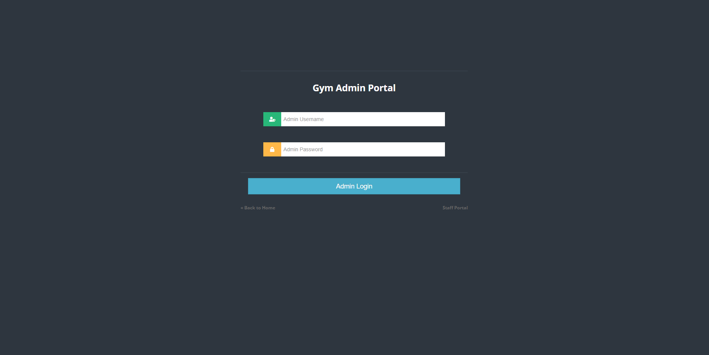
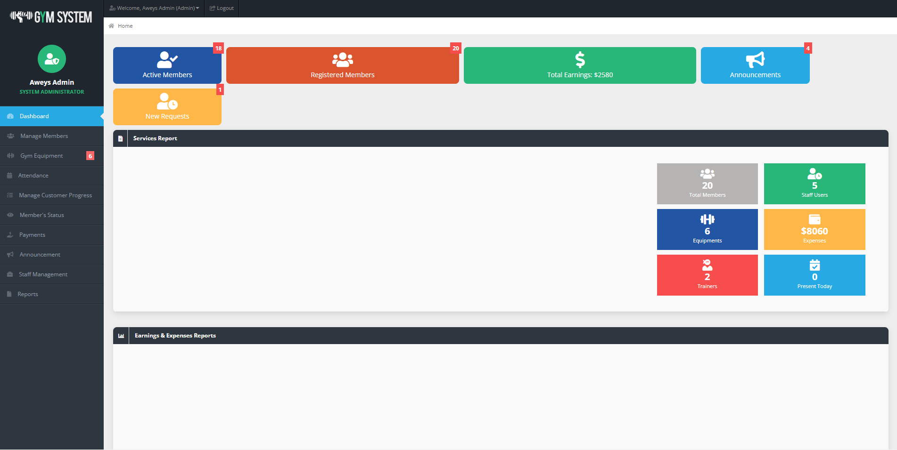
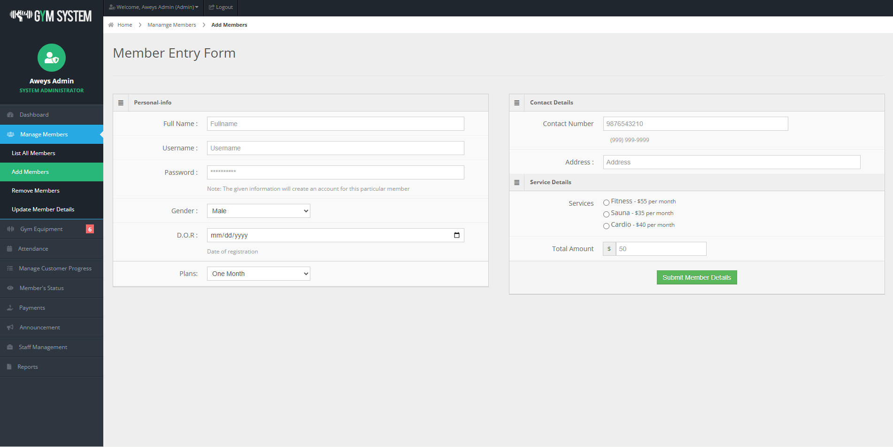
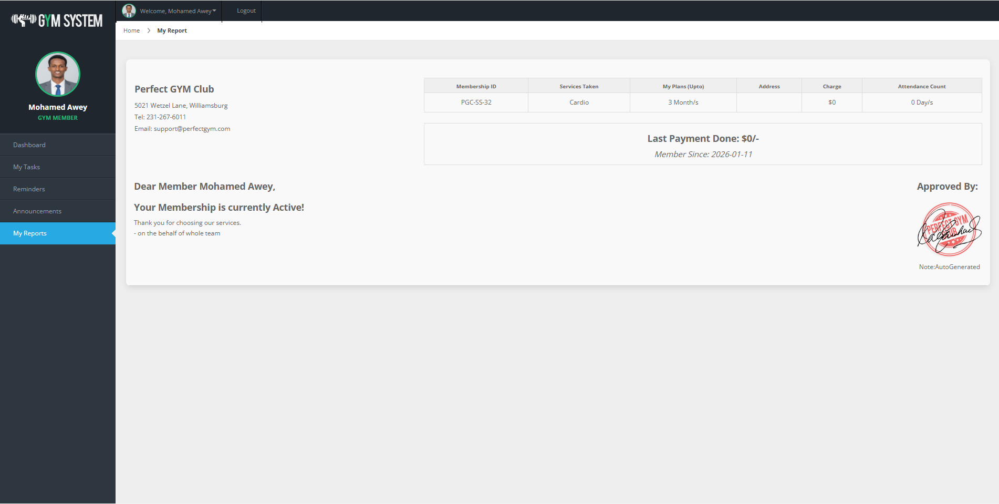

# Gym Management System

## Group Information

**Group** 2
**Class:** BIT29  
**Group Members:**

1. Mohamed Aweys Iman **ID:** 202200001
2. Abdikafi Abdulkadir ALi **ID:** 202200002
3. Mohamed Ahmed Ibrahim **ID:** 202200003

---

## Project Description

This is a full-featured Gym Management System developed for our Class **BIT29** project. It implements modern web development concepts using PHP and MySQL, focusing on security, user management, and seamless UI/UX. The system is designed to streamline the day-to-day operations of a fitness center, enabling efficient management of members, staff, equipment, and payments.

### Key Features

- **Three User Roles**: Admin, Staff, and Customer panels.
- **Member Management**: Complete lifecycle management from registration to active status.
- **Equipment Tracking**: Inventory management for gum equipment and purchases.
- **Reporting**: Visual charts and detailed reports for gym performance.
- **Security**: Secure session management and authentication.

---

## Project Screenshots

### 1. System Login & Overview

### 2. Admin Dashboard & Analytics

### 3. Member & Staff Management

### 4. Reports & Performance Tracking

---

## Installation & Setup

1. Copy the project folder to `htdocs`.
2. Import the `gymnsb.sql` database file into phpMyAdmin (`gym_system`).
3. Configure `dbcon.php` if necessary.
4. Access the system via `http://localhost/gymsystem`.
